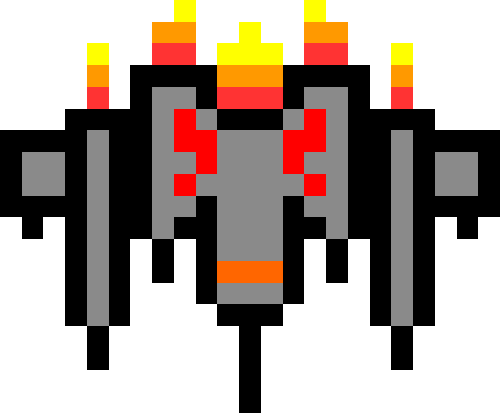
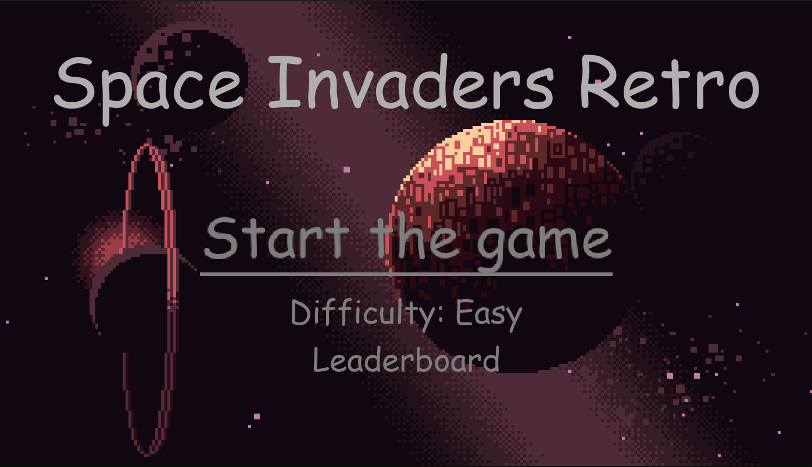
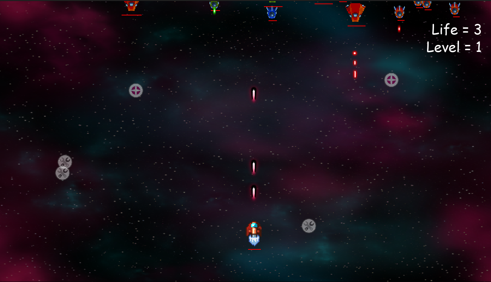

<a name="readme-top"></a>
[](https://github.com/julienbrs)
[![LinkedIn][linkedin-shield]][linkedin-url]

<!-- PROJECT LOGO -->
<br />
<div align="center">
  <a href="https://github.com/julienbrs/space-invaders-pygame">
    
  </a>

  </p>
</div>

<strong>Old project done in 2022</strong>

By being my very first project Python interface using Pygame, this implementation is not clean at all, most of the code is in the main.py file, very few classes are used and the code is not modular.

See a more recent implementation of the game in JS [here](https://github.com/julienbrs/Mail-invaders)

<!-- TABLE OF CONTENTS -->

<summary>Table of Contents</summary>
<ol>
<li>
    <a href="#about-the-project">About The Project</a>
</li>
<li>
    <a href="#getting-started">Getting Started</a>
    <ul>
    <li><a href="#prerequisites">Prerequisites</a></li>
    <li><a href="#installation">Installation</a></li>
    <li><a href="#usage">Usage</a></li>
    </ul>
</li>
<li><a href="#contact">Contact</a></li>
</ol>

<br />

<!-- ABOUT THE PROJECT -->

## About The Project

[](https://www.python.org/)
[](https://www.pygame.org/)

<!-- <p align="center">
  
</p> -->

A retro arcade classic, Space Invaders challenges players to fend off waves of incoming alien invaders, aiming to prevent them from reaching the bottom of the screen. This version of Space Invaders is made with Python and Pygame.

<br />
<p align="center">
  
</p>

<p align="right">(<a href="#readme-top">back to top</a>)</p>

<!-- GETTING STARTED -->

## Getting Started

To get a local copy up and running follow these simple example steps.

### Prerequisites

- python
  ```sh
  sudo apt install python3
  ```

### Installation

1. Clone the repo
   ```sh
   git clone https://github.com/julienbrs/space-invaders-pygame.git
   ```
2. Rights to execute
   ```sh
   chmod +x src/main.py
   ```
3. Then run the program
   ```sh
   ./src/main.py
   ```

<p align="right">(<a href="#readme-top">back to top</a>)</p>

## Usage

Simply run the game and use arrow keys to move left or right. Use the space bar to shoot lasers at incoming alien invaders. Defend your base, collect bonus and try to achieve the highest score!

<p align="center">
  
</p>


<p align="right">(<a href="#readme-top">back to top</a>)</p>

<!-- CONTACT -->

## Contact

Bourseau Julien - _1st year student at Ensimag, 2021/2022_ - julien.bourseau@gmail.com

Project Link: [https://github.com/julienbrs/space-invaders-pygame](https://github.com/julienbrs/space-invaders-pygame)

<p align="right">(<a href="#readme-top">back to top</a>)</p>

[linkedin-shield]: https://img.shields.io/badge/-LinkedIn-black.svg?style=for-the-badge&logo=linkedin&colorB=555
[linkedin-url]: https://www.linkedin.com/in/julien-bourseau-ba2239228
